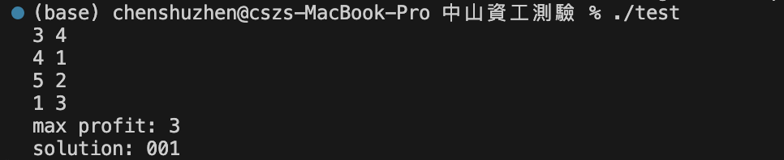
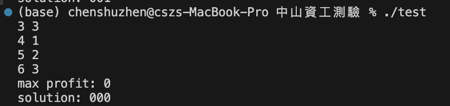
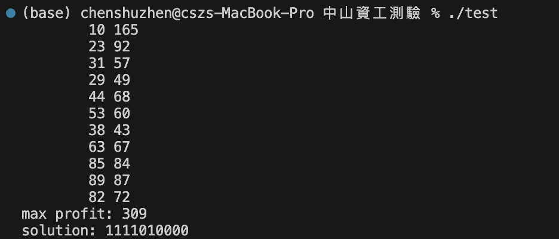

# 背包問題求解程式

## 1. 問題描述
給定N件物品，每件物品都有一些重量和利潤，以及一個容量為W的袋子。 任務是將物品放入袋子中，使得袋子的總重量不超過W，且總利潤最大。

## 2. 演算法說明
1. **初始化**：以性價比（profit/weight）作為排序依據產生初始可行解。
2. **鄰域搜尋**：嘗試翻轉一個 bit（代表選取或不選取某物品），產生鄰解。
3. **tabu list**：用以記錄近期的解向量（以避免重複搜尋）。
4. **接受條件**：若鄰解不在 tabu list 或其價值優於目前最佳解，則接受之。
5. **更新最佳解與 tabu list**。

## 3. 輸入輸出格式
### 輸入
第一行為：物品數量 N 與背包容量 W，第二行起為 N 個物品的重量與價值。

例如：
```
10 165
23 92
31 57
29 49
44 68
53 60
38 43
63 67
85 84
89 87
82 72
```

### 輸出
最大價值以及對應的解向量。

例如：
```
max profit: 309
solution: 1111010000
```

## 4. 執行方式
1. 編譯：使用 `g++ test2.cpp -o test`
2. 執行：`./test`

## 5. 測試結果
以下是程式的測試執行結果：

### 測試案例 1


### 測試案例 2


### 測試案例 3

